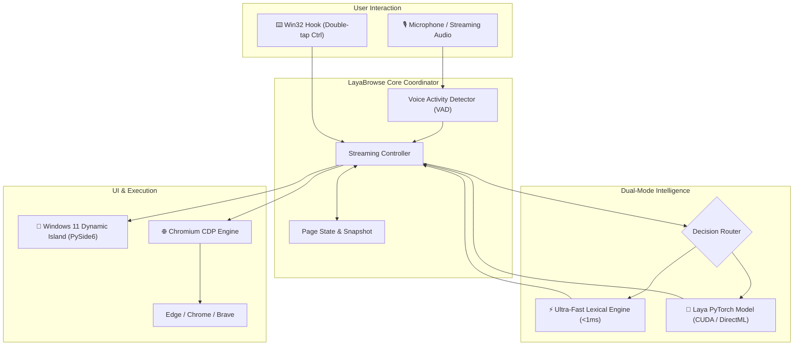

<div align="center">

# 🎙️ LayaBrowse for Windows

**Voice-control Microsoft Edge, Google Chrome, and Brave with local Laya decision models and a Windows 11 Dynamic Island overlay.**

[](https://microsoft.com/windows)
[](https://python.org)
[](https://www.chromium.org)
[](#architecture)
[](LICENSE)

<br/>

```text
Double-tap Left Control → “Open YouTube and search for Lo-Fi Beats”
                         → “Open the first video”
                         → “Theater mode”
                         → “In a new tab, open Wikipedia and search for Alan Turing”
                         → “Scroll down a little”
```

<p align="center">
  <a href="#-quickstart">Quickstart</a> •
  <a href="#-why-layabrowse">Why LayaBrowse?</a> •
  <a href="#-features">Features</a> •
  <a href="#-command-cookbook">Command Cookbook</a> •
  <a href="#-architecture">Architecture</a> •
  <a href="#-cli-reference">CLI Reference</a>
</p>

---

</div>

## 💡 Why LayaBrowse?

Traditional voice assistants and LLM agents generate arbitrary text token-by-token. This makes them:
- **Too slow** (1.5–5 seconds per decision)
- **Non-deterministic** (hallucinating URLs and inventing non-existent selectors)
- **Cloud-dependent** (leaking your live browsing data and passwords to third-party APIs)

**LayaBrowse is different.** It utilizes **Laya**, an open-source non-autoregressive **"System 1" decision engine**. Instead of generating prose, Laya evaluates a structured page state against typed operational questions in a **single forward pass (<15 ms)**.

It behaves like an instant cognitive reflex:
- **Privacy First:** 100% offline. No transcripts, URLs, or browsing history ever leave your machine.
- **Sub-Second Execution:** Commands are parsed and dispatched to the browser before you even finish speaking.
- **Zero Drivers Required:** Directly communicates with your browser over the Chrome DevTools Protocol (CDP).

---

## ✨ Features

<table>
  <tr>
    <td width="50%">
      <h3>🚀 Local Decision Engine</h3>
      Supports the official <b>Laya</b> model (PyTorch with NVIDIA CUDA, DirectML, and CPU acceleration) coupled with an ultra-fast sub-millisecond lexical fallback engine.
    </td>
    <td width="50%">
      <h3>🎨 Windows 11 Dynamic Island</h3>
      Hardware-accelerated, transparent glassmorphism overlay built with <b>PySide6</b>. Features real-time voice waveforms, streaming transcription, and execution badges.
    </td>
  </tr>
  <tr>
    <td width="50%">
      <h3>⌨️ Global Win32 Hotkey</h3>
      Double-tap <b>Left Control</b> from any window or game to toggle voice listening, powered by an efficient low-level Win32 keyboard hook (<code>WH_KEYBOARD_LL</code>).
    </td>
    <td width="50%">
      <h3>🌐 Universal Chromium CDP</h3>
      Controls <b>Microsoft Edge</b> (pre-installed on Windows 10/11), <b>Google Chrome</b>, or <b>Brave</b> with dedicated isolated profiles that remember your logins safely.
    </td>
  </tr>
  <tr>
    <td width="50%">
      <h3>🛡️ Safe Action Guardrails</h3>
      Financial checkouts, purchases, deletions, and account alterations are strictly gated by confirmation. Say <i>"confirm"</i> or <i>"cancel"</i> to proceed.
    </td>
    <td width="50%">
      <h3>📦 10+ Pre-Tuned Site Packs</h3>
      Includes hand-crafted, high-speed human phrasing rules for YouTube, GitHub, Gmail, Google, Wikipedia, Amazon, Netflix, Spotify, and more.
    </td>
  </tr>
</table>

---

## ⚡ Quickstart

### 1. Prerequisites
- **Operating System:** Windows 10 or Windows 11 (64-bit)
- **Python:** Python 3.10, 3.11, 3.12, or 3.13
- **Browser:** Microsoft Edge (built-in), Google Chrome, or Brave

### 2. Installation

Clone the repository and install the package:

```powershell
# Clone the repository
git clone https://github.com/AkshayKulkarni1904/laya-voice-browser.git
cd laya-voice-browser

# Install core dependencies in editable mode
pip install -e .
```

To install all optional extras (PyTorch GPU acceleration, Faster-Whisper STT, and PySide6 Dynamic Island):
```powershell
pip install -e ".[all]"
```

### 3. Verify Your Setup
Run the built-in diagnostic tool to ensure your Windows environment is fully configured:

```powershell
layabrowse doctor
```

Output:
```text
Running LayaBrowse Windows diagnostic checks...
  [PASS] Found browser: Microsoft Edge
  [PASS] Websockets library installed
  [PASS] PySide6 installed (Floating Island UI ready)

Result: ALL CHECKS PASSED
```

---

## 🚀 Running LayaBrowse

### Option 1: Start the Voice Browser
```powershell
layabrowse start
```

*Prefer Google Chrome instead of Microsoft Edge?*
```powershell
layabrowse start --browser chrome
```

### Option 2: 1-Click Windows Launcher
Double-click `scripts/run.bat` to launch immediately without opening a terminal.

### Option 3: Quick Command Test (Headless / CLI)
Test any voice command phrase without speaking:
```powershell
layabrowse test "open wikipedia and search for Alan Turing"
```

---

## 🗣️ Command Cookbook

### 🧭 Navigation & Search
- `"open Wikipedia"` → Navigates to `https://en.wikipedia.org`
- `"search for Quantum Computing"` → Executes web search on your default engine
- `"go to github.com"` → Directly resolves and visits the URL
- `"go back"` / `"go forward"` / `"reload"` → History and page refresh controls

### 📑 Tab Management
- `"in a new tab, search for NASA Webb telescope"` → Creates tab and executes query
- `"switch to the next tab"` / `"previous tab"` → Cycles active tabs
- `"close this tab"` / `"close other tabs"` → Closes selected tabs safely

### 🖱️ Element Interaction & Form Filling
- `"click View History"` → Matches on-page link or button text
- `"open the first result"` → Clicks the top result element
- `"type Alan Turing into the search box"` → Focuses input field and enters text
- `"press enter"` → Submits form or query

### 🎥 Media Controls
- `"pause"` / `"play"` → Controls HTML5 video/audio playback
- `"skip ahead 30 seconds"` → Seeks video forward
- `"mute"` / `"unmute"` → Toggles volume state
- `"turn on captions"` → Activates closed captions

### 🏷️ Ambiguity Resolution
When multiple candidate elements match your speech, LayaBrowse places small numbered badges on the page:
- Say `"one"`, `"two"`, or `"the second one"` to pick the exact element.

---

## 🧩 Site-Aware Packs

LayaBrowse includes fast lexical rules tailored for top web applications:

| Service | Supported Voice Shortcuts |
|---|---|
| **YouTube** | *"theater mode"*, *"full screen"*, *"mini player"*, *"first video"*, *"comments"*, *"turn on captions"* |
| **GitHub** | *"view code"*, *"open pull requests"*, *"open issues"*, *"read README"*, *"star repository"* |
| **Gmail** | *"compose new email"*, *"reply"*, *"forward"*, *"archive"*, *"search mail"* |
| **Google** | *"first result"*, *"second result"*, *"next page"*, *"image results"*, *"news"* |
| **Wikipedia** | *"random article"*, *"references"*, *"table of contents"*, *"beginning of article"* |
| **Amazon** | *"first product"*, *"add to cart"*, *"customer reviews"*, *"next page"* |
| **Spotify** | *"play"*, *"pause"*, *"next track"*, *"shuffle"*, *"repeat"* |
| **Netflix** | *"skip intro"*, *"next episode"*, *"audio and subtitles"* |

---

## 🏛️ Architecture



### macOS vs. Windows Architecture Comparison

| Subsystem | Original macOS Repo | LayaBrowse Windows |
|---|---|---|
| **Inference Framework** | Apple MLX (`laya-mlx`, Apple Silicon GPU) | **Official Laya (`convaiinnovations/laya`)** + PyTorch (CUDA / DirectML / CPU) + Sub-ms Rule Engine |
| **Browser Driver** | `safaridriver` + `/Applications` lookup | **Native Chromium CDP** (Microsoft Edge, Google Chrome, Brave via Windows Registry) |
| **Global Shortcut** | macOS `CGEventTap` / `NSEvent` | **Win32 Low-Level Hook** (`WH_KEYBOARD_LL`) via pure Python `ctypes` |
| **Floating UI Overlay** | macOS AppKit `NSPanel` notch island | **Windows 11 Fluent Dynamic Island** built with hardware-accelerated **PySide6** |
| **Speech-to-Text** | Apple Speech Framework (`SFSpeechRecognizer`) | **Streaming STT Coordinator** with energy VAD and Faster-Whisper support |

---

## 🛠️ CLI Reference

```text
usage: layabrowse [-h] [--browser {auto,edge,chrome,brave,opera}] [--model MODEL]
                  {start,status,doctor,test} ...

LayaBrowse for Windows: Voice-control Edge or Chrome with local Laya decisions.

positional arguments:
  start          Start the LayaBrowse voice listener and Dynamic Island
  status         Show system status, detected browsers, and engine configuration
  doctor         Run Windows diagnostic checks for audio, browser, and UI
  test           Test a single command phrase without speech

options:
  --browser      Choose browser backend: auto (default), edge, chrome, brave
  --model        Specify a custom Laya checkpoint or Hugging Face model
  --no-gui       Run in headless console mode without the floating island overlay
```

---

## 🧪 Testing

LayaBrowse comes with a comprehensive unit test suite:

```powershell
pytest tests/
```

```text
============================= test session starts =============================
platform win32 -- Python 3.13.9, pytest-8.4.2
collected 20 items

tests\test_chromium_win.py ....                                          [ 20%]
tests\test_laya_engine.py ..                                             [ 30%]
tests\test_policy.py ...                                                 [ 45%]
tests\test_spans.py ...........                                          [100%]

============================= 20 passed in 0.17s ==============================
```

---

## 🤝 Contributing

Contributions are welcome! Whether it's adding new site packs, improving speech recognition backends, or optimizing prompt budgets:

1. Fork the Project
2. Create your Feature Branch (`git checkout -b feature/AmazingFeature`)
3. Commit your Changes (`git commit -m 'feat: Add AmazingFeature'`)
4. Push to the Branch (`git push origin feature/AmazingFeature`)
5. Open a Pull Request

---

## 📜 License

Distributed under the **MIT License**. See [`LICENSE`](LICENSE) for more information.

*Attribution:* Derived and reverse-engineered from [aryanbhujade/laya-mlx-voice-browser](https://github.com/aryanbhujade/laya-mlx-voice-browser) and powered by [NandhaKishorM/laya](https://github.com/NandhaKishorM/laya).

---

<div align="center">
  <b>Built with ❤️ for Windows users who love fast, private, keyboardless web browsing.</b>
</div>
